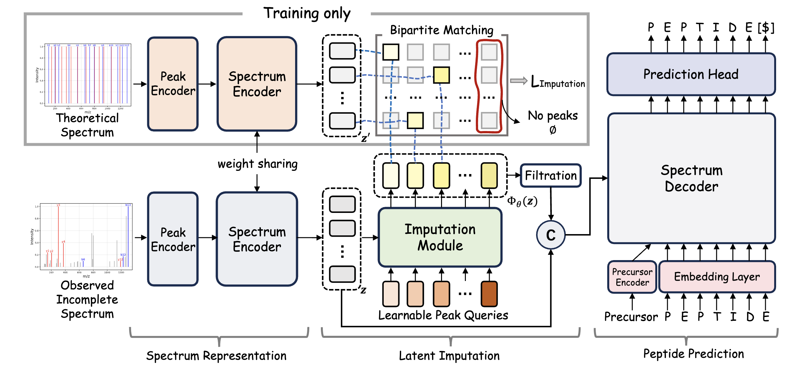

# LIPNovo

## Overview

The Pytorch implementation of _Latent Imputation before Prediction: A New Computational Paradigm for De Novo Peptide Sequencing._

[[arXiv]](TD) 

>De novo peptide sequencing is a fundamental computational technique for ascertaining amino acid sequences of peptides directly from tandem mass spectrometry data, eliminating the need for reference databases. Cutting-edge models usually encode the observed mass spectra into latent representations from which peptides are predicted autoregressively. However, the issue of missing fragmentation, attributable to factors such as suboptimal fragmentation efficiency and instrumental constraints, presents a formidable challenge in practical applications. To tackle this obstacle, we propose a novel computational paradigm called Latent Imputation before Prediction (LIPNovo). LIPNovo is devised to compensate for missing fragmentation information within observed spectra before executing the final peptide prediction. Rather than generating raw missing data, LIPNovo performs imputation in the latent space, guided by the theoretical peak profile of the target peptide sequence. The imputation process is conceptualized as a set-prediction problem, utilizing a set of learnable peak queries to reason about the relationships among observed peaks and directly generate the latent representations of theoretical peaks through optimal bipartite matching. In this way, LIPNovo manages to supplement missing information during inference and thus boosts performance. Despite its simplicity, experiments on three benchmark datasets show that LIPNovo outperforms state-of-the-art methods by large margins.
>

## Environment

```
conda create -n lipnovo python==3.10 
conda activate lipnovo
git clone https://github.com/usr922/LIPNovo.git
cd LIPNovo
pip install -r requriements.txt
```


## Data Preparation

Simply follow [NovoBench](https://github.com/jingbo02/NovoBench) for data preparation.


## Usage


### 1. Training

```bash
python tests/imputation_denovo.py \
--mode train \
--data_path $your_data_path \
--config_path configs/config.yaml
```


### 2. De Novo Sequencing

```bash
python tests/imputation_denovo.py \
--mode denovo \
--data_path $your_data_path \
--ckpt_path $your_trained_weight_path \
--denovo_output_path $your_results_save_path \
--config_path configs/config.yaml
```


### 3. Evaluation

```
python get_result.py
```


### Pretrained Models

TODO: Our pre-trained models will be uploaded later.


## Acknowledgement

We sincerely thank Dr. [Jingbo Zhou](https://arxiv.org/search/q-bio?searchtype=author&query=Zhou,+J), [Shaorong Chen](https://arxiv.org/search/q-bio?searchtype=author&query=Chen,+S), [Jun Xia](https://arxiv.org/search/q-bio?searchtype=author&query=Xia,+J) for their great work NovoBench in NeurIPS'24. We borrow codes heavily from their repositories.

## Citation

```
@inproceedings{du2025latent,
  title={Latent Imputation before Prediction: A New Computational Paradigm for De Novo Peptide Sequencing},
  author={Du, Ye and Yang, Chen and Yu, Nanxi and Lin, Wanyu and Zhao, Qian and Wang, Shujun},
  booktitle={International Conference on Machine Learning},
  year={2025}
}
```
